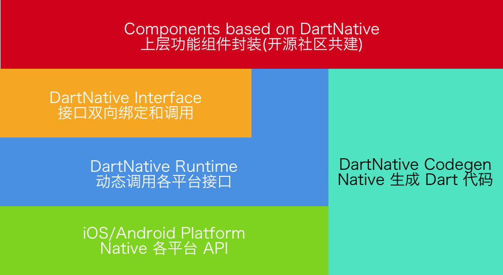

# dart_native

Write native code using Dart. This package liberates you from native code and low performance channel.

Still under development!!! 

[](https://pub.dev/packages/dart_native)
[](https://travis-ci.org/dart-native/dart_native)

This is the blue part(DartNative Bridge) in the picture below:



## 📲 Requirement

| DartNative Version | Requirements |
| --- | --- |
| 0.3.0 | Flutter 1.20.0 (Dart 2.9.1) |
| 0.2.0 | Flutter 1.12.13 (Dart 2.7) |

## 🌟 Feature

- [x] Support iOS & Android platform.
- [x] Sync/Async channel with high performance.
- [x] Generate Dart bridging code from native code.
- [x] Automatic object marshalling between Dart and native.

## 🔮 Getting Started

##### iOS:

Dart code:

```dart
// new Objective-C object.
RuntimeStub stub = RuntimeStub();

// Dart function will be converted to Objective-C block.
stub.fooBlock((NSObject a) {
    print('hello block! ${a.toString()}');
    return 101;
});

// support built-in structs.
CGRect rect = stub.fooCGRect(CGRect(4, 3, 2, 1));
print(rect);

```
Objective-C code:

```objc
typedef int(^BarBlock)(NSObject *a);

@interface RuntimeStub

- (CGRect)fooCGRect:(CGRect)rect;
- (void)fooBlock:(BarBlock)block;

@end
```

More ios example see: [ios_unit_test.dart](/dart_native/example/lib/ios/unit_test.dart)

##### Android:

Dart code:
```dart
// new Java object.
RuntimeStub stub = RuntimeStub();

// get java list.
List list = stub.getList([1, 2, 3, 4]);

// support interface.
stub.setDelegateListener(DelegateStub());

```
Java code:

```java
public class RuntimeStub {

    public List<Integer> getList(List<Integer> list) {
        List<Integer> returnList = new ArrayList<>();
        returnList.add(1);
        returnList.add(2);
        return returnList;
     }

    public void setDelegateListener(SampleDelegate delegate) {
         delegate.callbackInt(1);
    }
}
```
More android example see: [android_unit_test.dart](/dart_native/example/lib/android/unit_test.dart)
## 📚 Document

### Readme

1. [dart_native README.md](/dart_native/README.md)
2. [dart_native_gen README.md](/dart_native_gen/README.md)

### Blog

- [告别 Flutter Channel，调用 Native API 仅需一行代码！](http://yulingtianxia.com/blog/2020/06/25/Codegen-for-DartNative/)
- [如何实现一行命令自动生成 Flutter 插件](http://yulingtianxia.com/blog/2020/07/25/How-to-Implement-Codegen/)
- [用 Dart 来写 Objective-C 代码](http://yulingtianxia.com/blog/2019/10/27/Write-Objective-C-Code-using-Dart/)
- [谈谈 dart_native 混合编程引擎的设计](http://yulingtianxia.com/blog/2019/11/28/DartObjC-Design/)
- [DartNative Memory Management: Object](http://yulingtianxia.com/blog/2019/12/26/DartObjC-Memory-Management-Object/)
- [DartNative Memory Management: C++ Non-Object](http://yulingtianxia.com/blog/2020/01/31/DartNative-Memory-Management-Cpp-Non-Object/)
- [DartNative Struct](http://yulingtianxia.com/blog/2020/02/24/DartNative-Struct/)
- [在 Flutter 中玩转 Objective-C Block](http://yulingtianxia.com/blog/2020/03/28/Using-Objective-C-Block-in-Flutter/)
- [Passing Out Parameter in DartNative](http://yulingtianxia.com/blog/2020/04/25/Passing-Out-Parameter-in-DartNative/)

## 🐒 Q&A

Q: Failed to lookup symbol (dlsym(RTLD_DEFAULT, InitDartApiDL): symbol not found) on iOS archive.

There are two Workarounds:

1. Use dynamic library: Add `use_frameworks!` in Podfile.
2. Select Target Runner -> Build Settings -> Strip Style -> change from "All
Symbols" to "Non-Global Symbols"

## ❤️ Contributed

- If you **need help** or you'd like to **ask a general question**, open an issue.
- If you **found a bug**, open an issue.
- If you **have a feature request**, open an issue.
- If you **want to contribute**, submit a pull request.

## 👮🏻 License

DartNative is available under the BSD 3-Clause License. See the LICENSE file for more info.